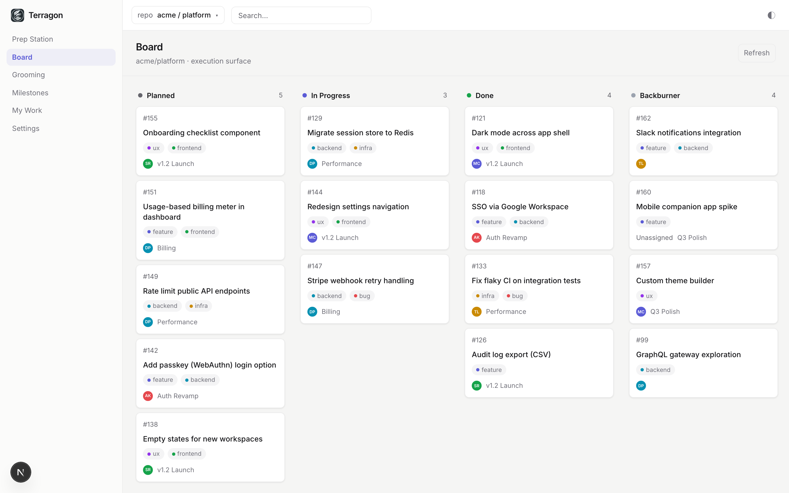
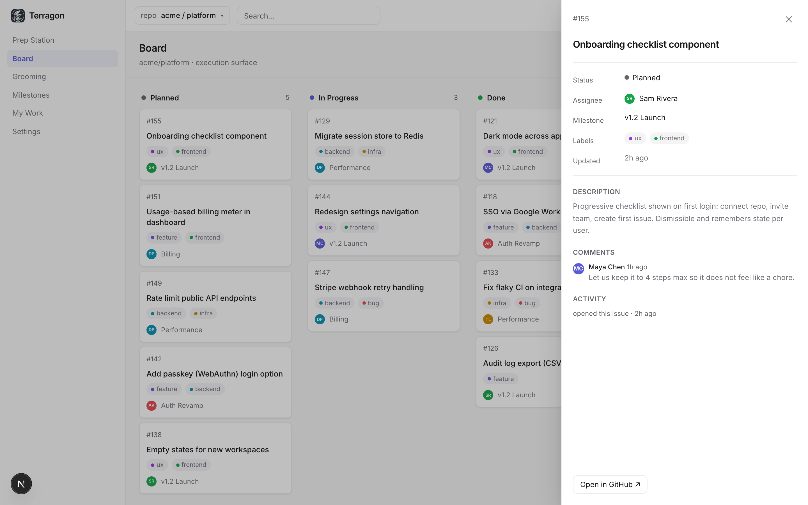
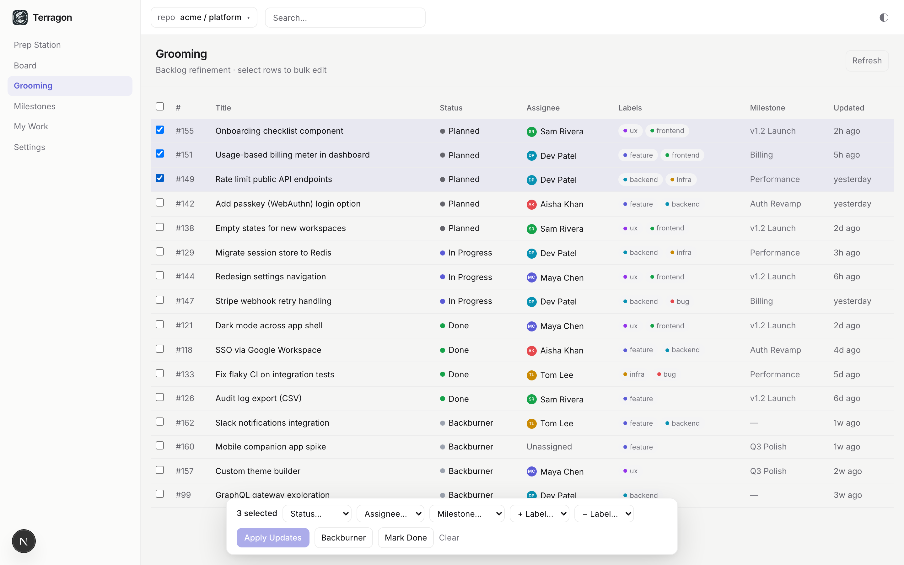

<p align="center">
  
</p>

<h1 align="center">Terragon</h1>

<p align="center">
  Turn GitHub Issues into a Kanban board.
</p>

<p align="center">
  <a href="https://vedanta.github.io/terragon/"><strong>🌐 Website</strong></a>
  ·
  <a href="https://github.com/vedanta/terragon/releases">Releases</a>
  ·
  <a href="#quickstart">Quickstart</a>
</p>

Terragon turns **GitHub Issues into a clean Kanban + grooming workspace** — without replacing GitHub as the source of truth. It sits in the gap between raw GitHub Issues and heavyweight tools like Jira or Linear: enough structure to actually run the work, nothing you have to migrate into.

> GitHub Issues are the task system. Terragon is the execution surface.



<p align="center">
  
  
</p>

## Features

- **Live Kanban board** — your repo's issues in four columns: Planned · In Progress · Done · Backburner.
- **Drag to change status** — moving a card updates GitHub labels instantly (optimistic, with rollback on failure).
- **Inline issue editing** — title, body, assignee, labels, milestone, and status from a side drawer.
- **Batch grooming** — multi-select issues, stage a change-set, apply it in one action with **partial-success** reporting ("6 of 7 updated · #148 failed: no permission").
- **GitHub-native** — GitHub stays the source of truth; Terragon stores only settings, repo mappings, and encrypted tokens.
- **Views** — Prep Station (work readiness), Milestones (progress), My Work (assigned to you), plus a ⌘K command palette.

## How it works

Terragon is **additive, not a migration**. It maps board status onto a small GitHub label namespace and reconciles it with GitHub's native open/closed state:

```
terragon/planned · terragon/in-progress · terragon/done · terragon/backburner
```

- **Exactly one `terragon/*` status label per issue.** Status is resolved on every read, so it self-heals.
- **A closed issue reads as Done** regardless of labels; moving a card to **Done closes the issue** (configurable), and moving it out reopens it.
- **Labels are created automatically** on first use, and you can remap them per repository in Settings.

Because everything lives in GitHub, your team keeps using Issues, PRs, and the GitHub UI exactly as before — Terragon is just a faster surface on top. See [`docs/architecture.md`](docs/architecture.md) for the full model.

## Quickstart

**Prerequisites**

- Node.js 22+
- A **GitHub OAuth App** (Settings → Developer settings → OAuth Apps). Callback URL: `http://localhost:3000/api/auth/callback/github`
- A **Postgres** database URL (e.g. [Neon](https://neon.tech))

**Setup**

```bash
git clone https://github.com/vedanta/terragon.git
cd terragon
npm install
cp .env.example .env      # then fill in the values below
npm run db:migrate        # apply the schema
npm run dev               # http://localhost:3000
```

By default the app runs on **seeded demo data** (no GitHub calls). To use your own repository, set `USE_FIXTURES=false`, sign in, and pick a repo in **Settings**.

## Configuration

Environment variables (see [`.env.example`](.env.example)):

| Variable                                | Required | Purpose                                                        |
| --------------------------------------- | -------- | -------------------------------------------------------------- |
| `DATABASE_URL`                          | yes      | Postgres connection string (Terragon-owned data only)          |
| `AUTH_SECRET`                           | yes      | Auth.js session secret (`openssl rand -base64 32`)             |
| `AUTH_GITHUB_ID` / `AUTH_GITHUB_SECRET` | yes      | GitHub OAuth App credentials                                   |
| `TERRAGON_ENCRYPTION_KEY`               | yes      | Encrypts GitHub access tokens at rest (`openssl rand -hex 32`) |
| `USE_FIXTURES`                          | no       | `true` (default) serves demo data; `false` uses live GitHub    |

**Workspace settings** (per repository, in the app): status-label names and whether moving to Done closes the issue (`auto_close_done`).

## Deployment

Terragon deploys cleanly to **Vercel** (Node.js runtime; standard Next.js):

1. Import the repo into Vercel and provision a Postgres database (Neon via the Marketplace).
2. Create a **separate GitHub OAuth App for production** — a classic OAuth App allows only one callback URL, so dev and prod each need their own (`https://<your-domain>/api/auth/callback/github`).
3. Set the env vars above in the Vercel project (Production), including `USE_FIXTURES=false` for live data.
4. Deploy. Migrations run via `npm run db:migrate`.

## Tech stack

Next.js 16 (App Router) · TypeScript · Tailwind v4 · Auth.js (GitHub OAuth) · Neon Postgres + Drizzle · Octokit (GraphQL reads / REST writes) · Vercel.

Architecture detail and diagrams: [`docs/architecture.md`](docs/architecture.md).

## Development

```bash
npm run dev          # dev server
npm run build        # production build
npm run lint         # eslint
npm run typecheck    # tsc --noEmit
npm run test         # unit tests (vitest)
npm run test:e2e     # end-to-end (playwright)
npm run db:generate  # generate a migration from schema changes
npm run db:migrate   # apply migrations
```

CI (GitHub Actions) runs lint · typecheck · test · build · e2e on every PR; `main` is protected and requires green checks.

## Roadmap

Planned (see open issues): a dedicated create-issue flow, deep-linking from the command palette, a combined public-demo + live mode, and batch-write optimizations. Longer-term: webhooks, multi-repo, and saved filters.

## Docs

| Doc                                            | What it covers                                      |
| ---------------------------------------------- | --------------------------------------------------- |
| [`docs/quickstart.md`](docs/quickstart.md)     | Get running in a few minutes                        |
| [`docs/installation.md`](docs/installation.md) | Full self-host + deployment guide                   |
| [`docs/architecture.md`](docs/architecture.md) | System architecture, data + status model (diagrams) |
| [`docs/design.md`](docs/design.md)             | UX / interface design                               |
| [`docs/ui-spec.md`](docs/ui-spec.md)           | Design tokens, typography, interaction constants    |

## License

**Apache License 2.0** — see [`LICENSE`](LICENSE) and [`NOTICE`](NOTICE). © 2026 Vedanta Barooah.

Permissive open source: you may use, modify, distribute, and run Terragon (including commercially), provided you retain the copyright/notice and state your changes. The license includes an explicit patent grant.

## Contributing

See [`CONTRIBUTING.md`](CONTRIBUTING.md), our [`CODE_OF_CONDUCT.md`](CODE_OF_CONDUCT.md), and the [security policy](SECURITY.md).
