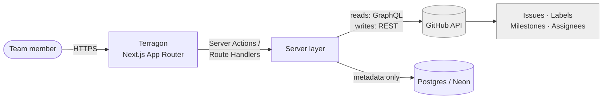
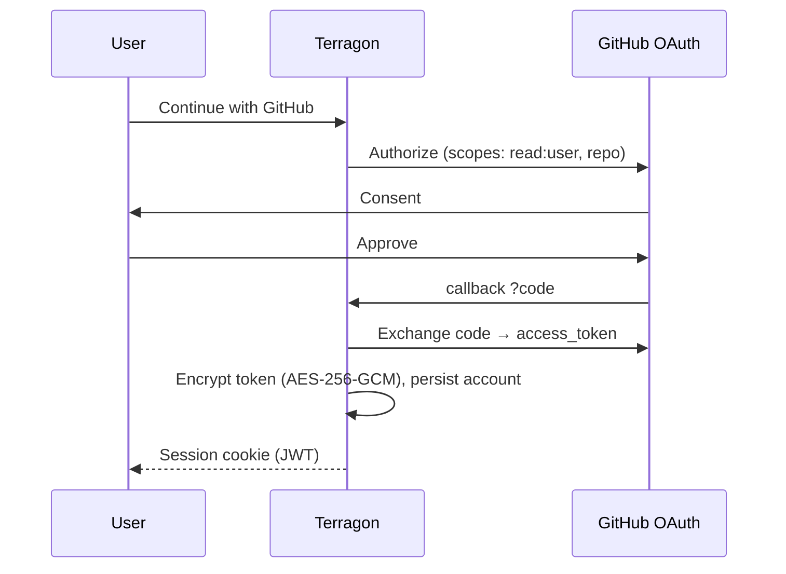
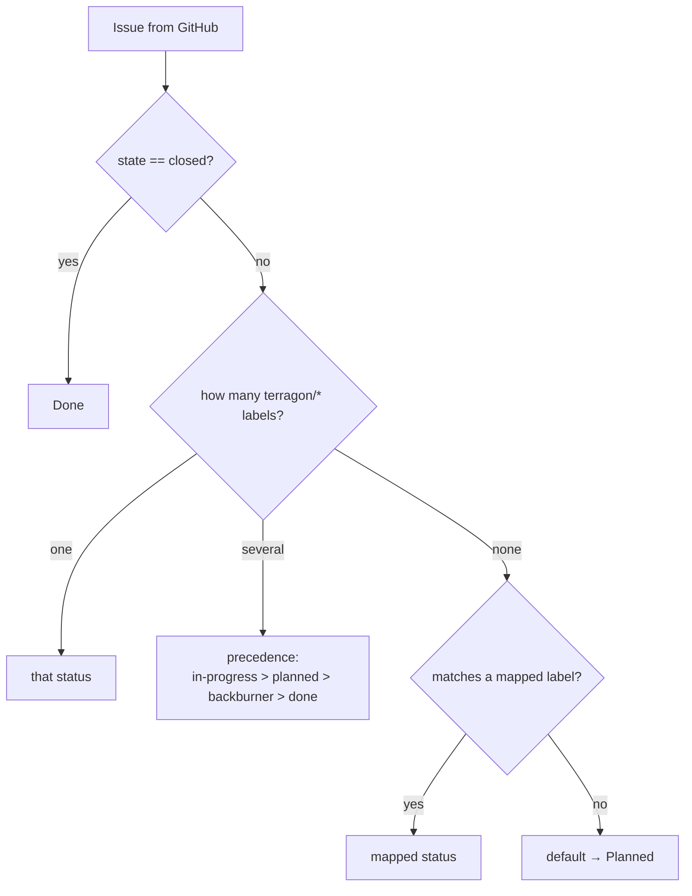
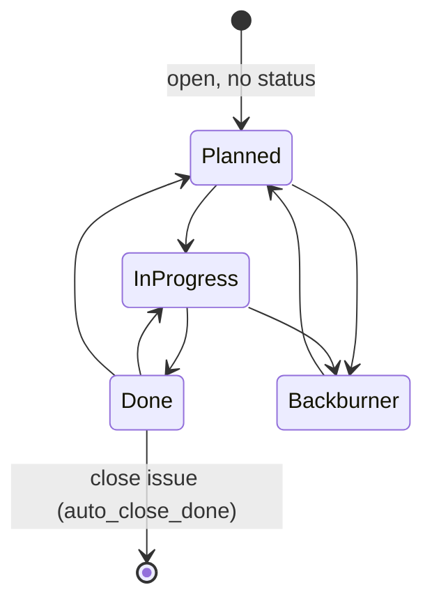
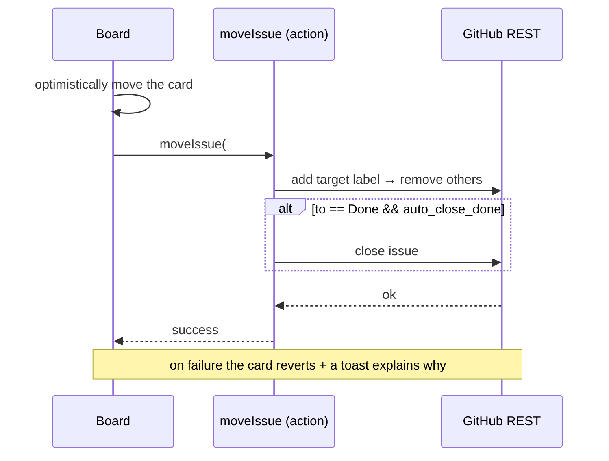
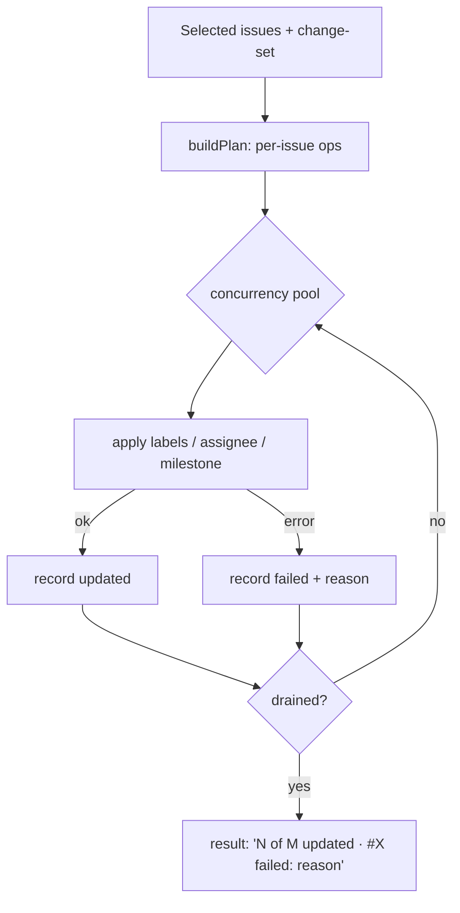

# Architecture

How Terragon works: a GitHub-native execution layer over GitHub Issues, built with Next.js (App Router).

**Guiding invariant:** GitHub is the system of record. Terragon stores only its own metadata (settings, repo mappings, encrypted tokens, an audit log) — never a duplicate copy of issues. All GitHub calls happen server-side; tokens never reach the browser.

## 1. System context



## 2. Stack

| Layer | Technology |
|-------|-----------|
| Framework | Next.js 16 (App Router, Server Components) + TypeScript |
| UI | Tailwind v4 · `cmdk` (command palette) · native HTML5 drag-and-drop |
| Client state | React `useOptimistic` / `useTransition` (the board); server state via Server Components |
| Auth | Auth.js v5 (`next-auth`) + GitHub OAuth provider, JWT sessions |
| Database | Neon Postgres + Drizzle ORM (`drizzle-kit` migrations) |
| GitHub | Octokit — GraphQL for reads, REST for writes |
| Hosting | Vercel (Node.js runtime) |

## 3. Code map

```
app/
  (marketing)/        landing
  (auth)/login/       sign-in
  (app)/              authenticated app (board, grooming, prep, milestones, my-work, settings)
    */actions.ts      server actions (writes)
  api/auth/[...nextauth]/  Auth.js route handler
proxy.ts              route protection (Next.js middleware)
auth.ts / auth.config.ts  Auth.js config (+ encrypted-token adapter)
db/
  schema.ts           Drizzle schema
  index.ts            Neon client
  migrations/         SQL migrations
lib/
  github/client.ts    the single GitHub client (GraphQL + REST, backoff, concurrency)
  status/resolve.ts   label ↔ status resolution
  status/transition.ts  status-change planning
  board/service.ts    raw issues → resolved → columns
  grooming/service.ts batch plan + execution (partial success)
  view/board-issue.ts presentation view-model
  crypto.ts           AES-256-GCM token encryption
  board-data.ts       data source (fixtures or live, behind USE_FIXTURES)
  workspace.ts        per-repo settings
```

## 4. Authentication

Auth.js v5 with the GitHub OAuth provider and JWT sessions. The GitHub **access token is encrypted at rest** before it touches the database, and decrypted only server-side when a request needs to call GitHub.



`proxy.ts` gates the `(app)/*` routes: an unauthenticated request is redirected to `/login`.

## 5. Data model

Terragon-owned tables only (Drizzle, `db/schema.ts`). GitHub issue data is fetched live, never stored as a system of record.

```mermaid
erDiagram
  user ||--o{ account : has
  user ||--o{ session : has
  user ||--o{ user_repository : opens
  repository ||--o{ user_repository : linked
  repository ||--|| workspace_settings : configured_by
  repository ||--o{ sync_event : logs

  user { text id PK; text email; text name; text image }
  account { text userId FK; text provider; text access_token "encrypted" }
  repository { text id PK; text github_repo_id; text full_name; bool private }
  user_repository { text id PK; text user_id FK; text repository_id FK; timestamp last_opened_at }
  workspace_settings { text id PK; text repository_id FK; text label_planned; bool auto_close_done; text accent; text default_theme }
  sync_event { text id PK; text repository_id FK; text event_type; text status }
```

## 6. Status model

Board status is stored as GitHub **labels**, reconciled with GitHub's native open/closed state:

```
terragon/planned · terragon/in-progress · terragon/done · terragon/backburner
```

### Resolution (read time)

Status is resolved on every read, so it self-heals if labels ever drift:



### Transitions (write time)

`transitionPlan()` computes the mutations for a status change. To never leave an issue statusless, the target label is **added first, then the others removed**; moving to Done **closes** the issue (when `auto_close_done` is on) and moving out reopens it.



## 7. GitHub client

`lib/github/client.ts` is the only module that talks to GitHub — callers never see GraphQL vs REST. It owns:

- **Reads (GraphQL):** issues (paginated), repo metadata (labels, milestones, assignable users), the viewer.
- **Writes (REST):** add/remove labels, close/reopen, update title/body, set assignees/milestone, ensure the `terragon/*` labels exist.
- **Resilience:** exponential backoff on rate-limit / secondary-limit responses, and a concurrency limiter (`p-limit`) shared by batched work.

## 8. Key flows

### Move issue (optimistic + rollback)



### Batch grooming (partial success)



A batch never aborts on a single failure — it reports per-issue outcomes and audits the run to `sync_event`.

## 9. Data sources & demo mode

`lib/board-data.ts` resolves the board's issues. With `USE_FIXTURES=true` (the default) it serves seeded demo data and makes no GitHub calls — useful for local development and a public demo. With `USE_FIXTURES=false` it loads the signed-in user's selected repository live via the GitHub client and the status resolver.

## 10. Security

- All GitHub calls are server-side; the access token never reaches the client.
- Tokens are **encrypted at rest** (AES-256-GCM, `lib/crypto.ts`) and decrypted only in server code.
- Sessions use HTTP-only cookies (Auth.js); `proxy.ts` enforces auth on app routes.
- Mutations are audited to `sync_event`.

## 11. Deployment

Deploys to Vercel on the Node.js runtime. Requires `DATABASE_URL` (Neon), the GitHub OAuth credentials, `AUTH_SECRET`, and `TERRAGON_ENCRYPTION_KEY`; set `USE_FIXTURES=false` for live data. Observability is via platform logs plus the `sync_event` audit table. See [installation.md](./installation.md) for the full setup.
