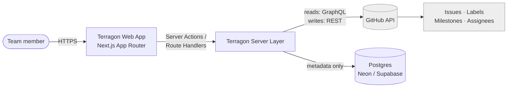
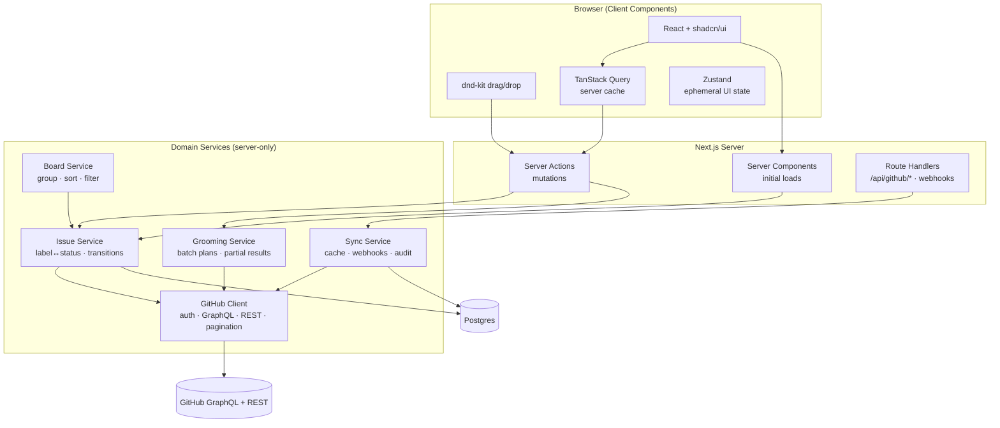
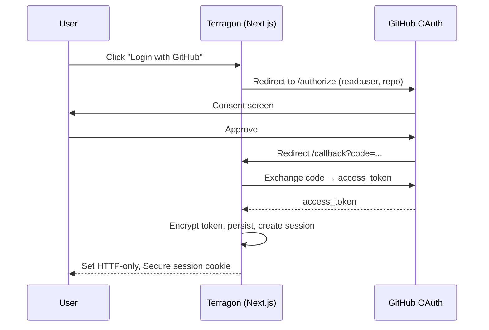
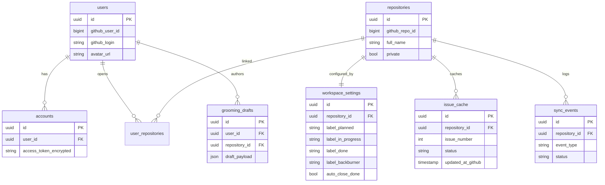
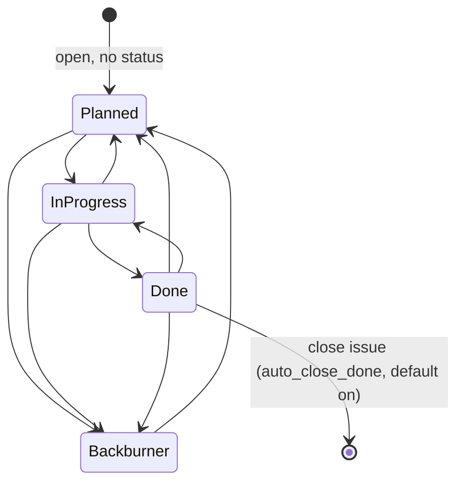
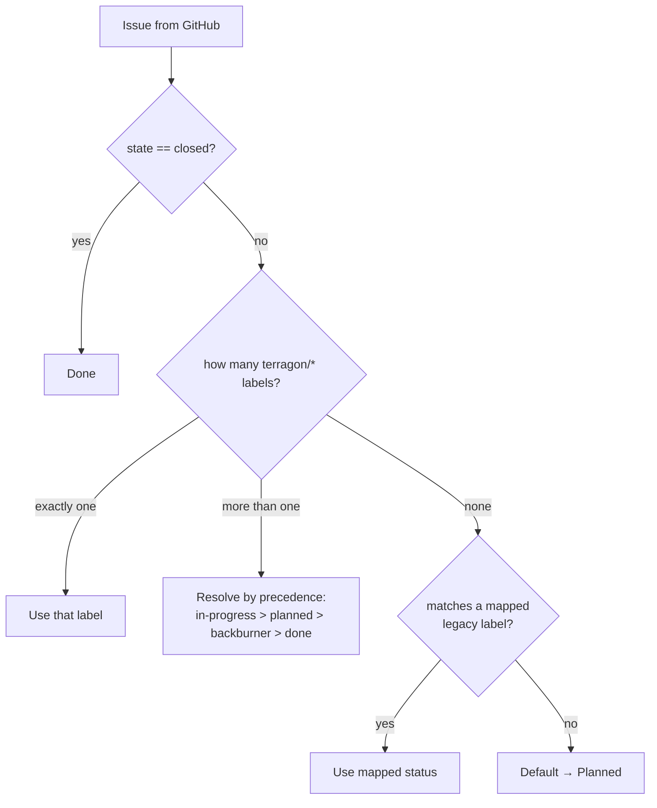
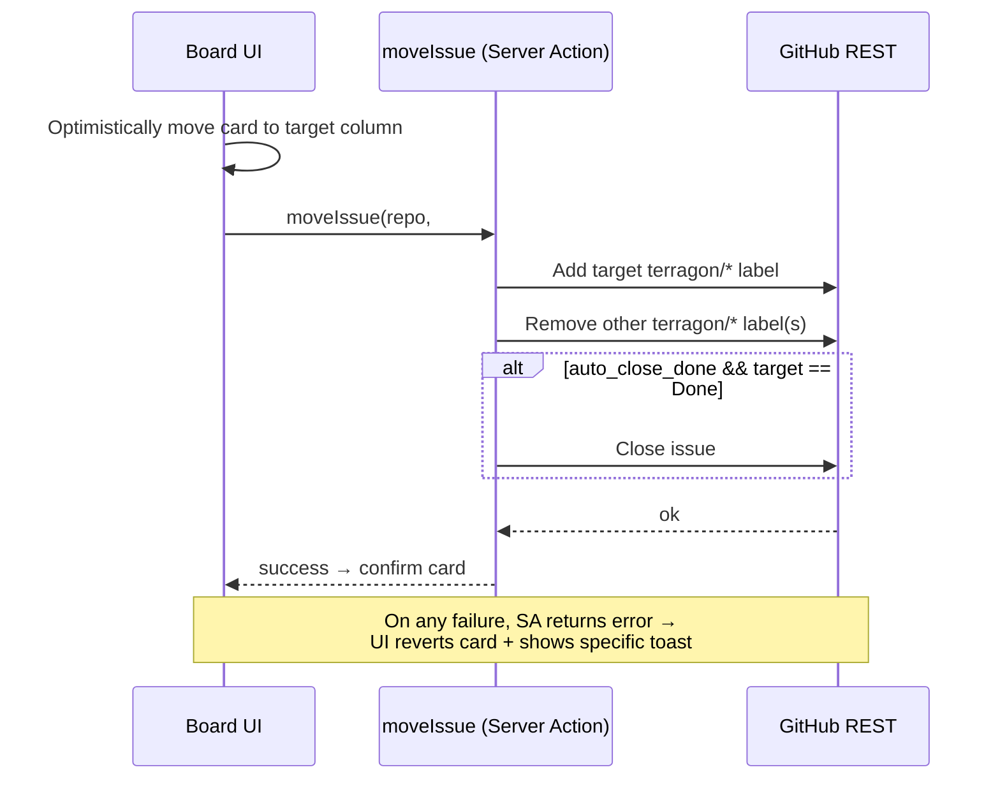
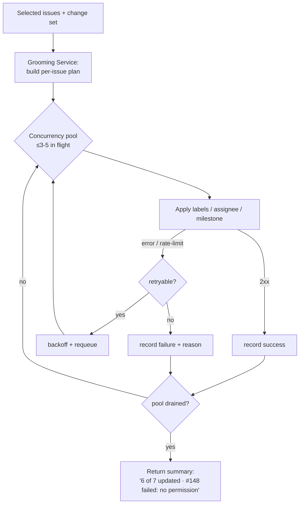
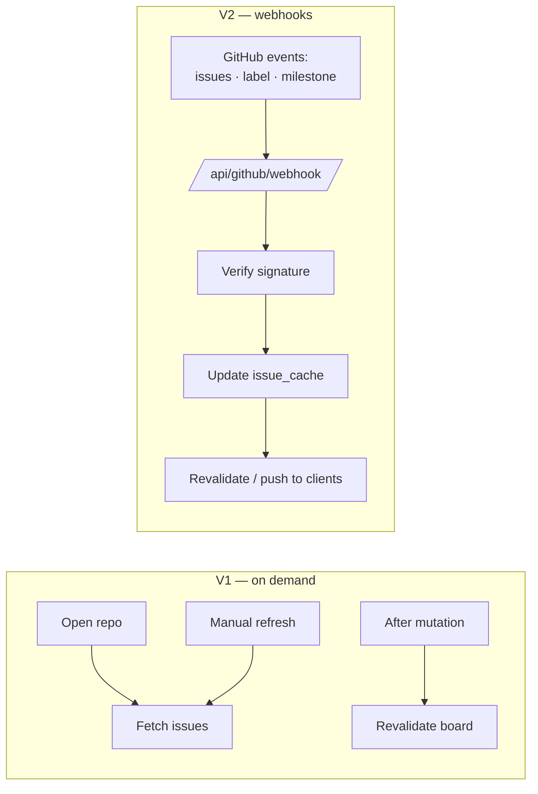
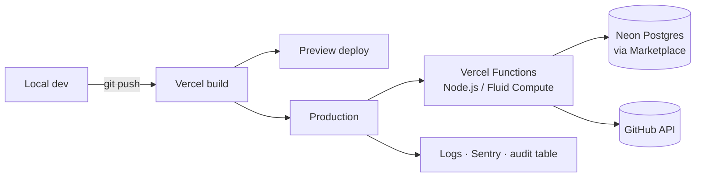

# Terragon — Architecture

Technical architecture for Terragon: a GitHub-native execution layer over GitHub Issues. This document supersedes the architecture portions of `concept/concept.md` (§13–§27) and folds in the decisions from [`concept-validation.md`](./concept-validation.md).

**Guiding invariant:** GitHub is the system of record. Terragon persists only its own metadata, preferences, and an optional cache. All GitHub calls are server-side; tokens never reach the client.

---

## 1. System Context



GitHub owns all issue data. The Postgres DB owns only Terragon-specific state (settings, repo mappings, encrypted tokens, sync log, optional cache).

---

## 2. Containers & Domain Services



**Service responsibilities** (single GitHub client; everything else composes it):

- **GitHub Client** — the only module that talks to GitHub. Hides GraphQL (reads) and REST (writes) behind one typed interface; owns auth headers, pagination, rate-limit handling, and backoff.
- **Issue Service** — maps a GitHub issue → a Terragon task, resolves status from labels + native state, and enforces transition rules.
- **Board Service** — groups resolved issues into the four columns, applies sort/filter and board preferences.
- **Grooming Service** — turns a multi-select + change set into a per-issue update plan, executes with controlled concurrency, returns a partial-success summary.
- **Sync Service** — on-demand refresh, V2 webhook ingestion, and the audit/sync-event log.

---

## 3. GitHub API Strategy

Hybrid by design (see validation §6 — wrapped in one client):

| Concern | API | Why |
|---------|-----|-----|
| Read issues, labels, milestones, assignees, pagination | **GraphQL** | One round-trip per page; far more rate-limit efficient than REST list+expand. |
| Update issue, add/remove labels, set assignees/milestone, close/reopen | **REST** | Simpler, well-documented mutation endpoints; easier partial-failure handling. |

- **Rate limits:** primary 5000/hr per user *and* secondary/abuse limits on bursts. Batch mutations run at concurrency ≤3–5 with exponential backoff on `403`/secondary-limit responses.
- **Pagination:** cursor-based (GraphQL `pageInfo`). MVP scopes the board to open + recently-closed issues.

---

## 4. Authentication

**MVP: Auth.js + GitHub OAuth App** (non-expiring user tokens — simplest). Migrate to a GitHub App for V2 (webhooks, fine-grained perms, expiring tokens).



- Scopes: `read:user`, `repo` (private) or `public_repo` (public-only).
- Tokens are **encrypted at rest** (`TERRAGON_ENCRYPTION_KEY`), decrypted only inside the GitHub Client. Never serialized to the client.
- Session via HTTP-only Secure cookie; CSRF protection on mutations.

---

## 5. Data Model

Terragon-owned tables only. GitHub data is fetched live (or cached, never authoritative).



Notes vs. spec §17: `accounts` drops `refresh_token`/`token_expires_at` for the OAuth-App MVP (re-add with GitHub App). `issue_cache` and `grooming_drafts` are optional — build only when needed.

---

## 6. Status Model

Board status lives in the `terragon/*` label namespace, reconciled with GitHub's native open/closed state.

```
terragon/planned · terragon/in-progress · terragon/done · terragon/backburner
```

### Transitions



### Status Resolution (read time)

Because labels and native state can disagree (validation §1, §2, §4), status is **resolved on every read** — this also self-heals partial-failure label states:



### Write rule (atomic-safe ordering)

To never leave an issue statusless: **add target label first, then remove other `terragon/*` labels.** If the remove step fails, the next read resolves by precedence and a later sync cleans up.

---

## 7. Key Flows

### Move issue (drag-drop, optimistic + rollback)



### Batch grooming update (partial success)



### Sync (V1 on-demand → V2 webhooks)



---

## 8. Cross-Cutting Concerns

- **Caching:** server-side cache for repo metadata; TanStack Query for board data on the client; optional `issue_cache` table for fast reload. Revalidate after every mutation.
- **Error handling:** specific, calm messages (`Could not update #142 — milestone no longer exists`), never "Something went wrong." Batch operations always report partial success. Expired/invalid auth → prompt re-login.
- **Security:** all GitHub calls server-side; tokens encrypted at rest and never client-exposed; HTTP-only Secure session cookies; CSRF protection; request minimum scopes; audit every mutation in `sync_events` (user, repo, issue, action, result, timestamp).
- **Performance targets (MVP):** board load <2s (<200 open issues), drag feedback <300ms (optimistic), batch >20 issues shows progressive state, local search <200ms after load.

---

## 9. Routes

```
app/
  (marketing)/page.tsx
  (auth)/login/page.tsx
  (auth)/callback/route.ts
  (app)/layout.tsx
  (app)/prep/page.tsx
  (app)/board/page.tsx
  (app)/grooming/page.tsx
  (app)/milestones/page.tsx
  (app)/my-work/page.tsx
  (app)/settings/page.tsx
api/github/
  callback/  webhook/  repos/  issues/  batch-update/
```

---

## 10. Deployment



- **Hosting:** Vercel (standard Node.js / Fluid Compute runtime — not edge; see validation Tech Corrections).
- **Database:** Neon Postgres via Vercel Marketplace (Vercel Postgres is deprecated). Drizzle ORM recommended.
- **Observability:** Vercel logs + Sentry + `sync_events` audit table.
