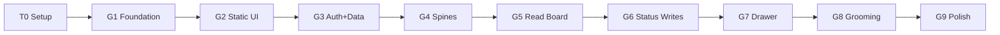

# Terragon — Delivery Plan

How the [implementation plan](./implementation-plan.md) is executed: as **T0 (operator setup)** + **9 groups of 5 tasks**, each task a GitHub issue, each group a working branch merged to `main` via a human-in-the-loop (HITL) PR. Repo: [vedanta/terragon](https://github.com/vedanta/terragon).

## Locked process decisions

- **Seed `main` with planning docs first** — push this repo (CLAUDE.md, `docs/`, `fixtures/`) to establish `terragon`'s default branch; groups build on top.
- **Issues just-in-time per group** — T0 + all 9 milestones + group labels created upfront for the roadmap; each group's 5 issues created when the group starts.
- **Squash-merge, HITL gate** — every group PR squashes to one commit on `main`; requires **1 approving review + green CI** before merge.

## T0 — Operator Setup (umbrella issue, manual)

One tracking issue, a checklist of credential/service work only the operator can do:

| Item | Gates |
|------|-------|
| `gh auth refresh -s project,read:project` | project board ops |
| Create/configure GitHub Project board + link repo | board |
| Branch protection on `main` (require PR + 1 approval + CI, no direct push) | the HITL gate |
| GitHub **OAuth App** (client id/secret; callbacks: local/preview/prod) | G3 |
| **Neon Postgres** via Vercel Marketplace → `DATABASE_URL` | G3 |
| **Vercel project** linked; env `AUTH_SECRET`, `AUTH_GITHUB_ID/SECRET`, `TERRAGON_ENCRYPTION_KEY`, `DATABASE_URL` | G3 / deploy |
| **Sentry** project → `SENTRY_DSN` | G9 |
| Local `.env` from `.env.example` | local dev |

## Groups (45 issues)

Linear flow — each group branches off `main`, merges back via HITL PR before the next begins.

| Group · branch | Tasks |
|---|---|
| **G1 — Foundation & Design System** `feat/g1-foundation` | Scaffold Next.js+TS+Tailwind+shadcn+route groups · Tokens/Inter/theming (ui-spec) · App shell (static) · Tooling+CI · Fixtures provider |
| **G2 — Static UI Surfaces** `feat/g2-static-ui` | Board from fixtures · Issue drawer (unwired) · Grooming table · Command palette + ⌘K/Esc · Empty/loading/error states + microcopy |
| **G3 — Auth & Data Layer** `feat/g3-auth-data` | Drizzle+Neon schema+migrations · Auth.js GitHub OAuth + adapter · Token encryption at rest · proxy.ts protection + login/logout · Repo picker |
| **G4 — Technical Spines** `feat/g4-spines` | GitHub Client scaffold (rate-limit/backoff) · Client reads (GraphQL) · `resolveStatus` + tests · `transitionPlan` + tests · Board Service + integration test |
| **G5 — Live Board (Read)** `feat/g5-read-board` | Wire board to live data · Refresh + real-data states · Pagination · Repo-metadata cache · E2E login→repo→board |
| **G6 — Status Writes & Drag/Drop** `feat/g6-status-writes` | Client writes + `ensureLabels` · `moveIssue` (add-then-remove + auto-close) · Optimistic dnd + rollback · Label-mapping settings · Failure/self-heal tests + E2E |
| **G7 — Issue Drawer Editing** `feat/g7-drawer` | Edit title/body · Assignee/Label/Milestone/Status pickers · Status change reuses transition · Conflict handling · Comments/activity display |
| **G8 — Grooming & Batch** `feat/g8-grooming` | `buildPlan` · `execute` (concurrency+backoff) · Batch bar UI · Partial-success + audit · Partial-fail + 50-issue tests + E2E |
| **G9 — Polish & Launch** `feat/g9-polish` | State coverage + re-login · Palette actions + full keymap · Prep/Milestones/My Work views · Responsive + landing · Observability + readiness |

## GitHub conventions

- **Milestone per group**: `G1 — Foundation & Design System`, … (progress %).
- **Label per group**: `group:g1` … `group:g9` (color-coded); `setup` for T0.
- **Project board** columns: Todo / In Progress / In Review / Done.
- **Branches**: `feat/gN-slug` off `main`.
- **Issue → PR linkage**: PR body lists `Closes #…` for its 5 issues.

## Per-group loop (HITL)

1. Branch `feat/gN-slug` off `main`.
2. Create the group's 5 issues (milestone + `group:gN` label, added to board).
3. Implement; commits reference issues (`refs #id`).
4. Open PR → `main` with `Closes #…` + a checklist of the 5 tasks; CI runs.
5. **Operator reviews** (HITL): request changes or approve.
6. **Squash-merge**; issues auto-close, cards → Done.
7. Next group branches off updated `main`.

## Bootstrap sequence (one-time, before G1)

1. Add `terragon` remote; push local `main` (seeds docs/fixtures, establishes default branch).
2. Enable branch protection on `main` (require PR + 1 approval; add required CI check once G1 adds the workflow).
3. Create T0 umbrella issue + 9 group milestones + `group:g*`/`setup` labels.
4. *(After operator runs the project-scope refresh)* configure the project board and add T0.
