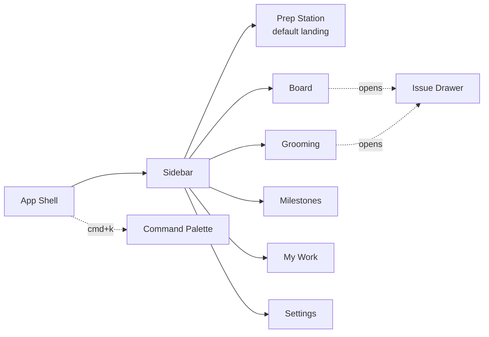
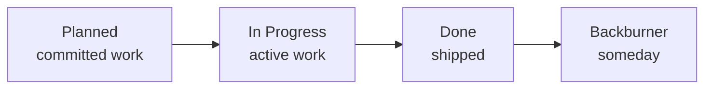
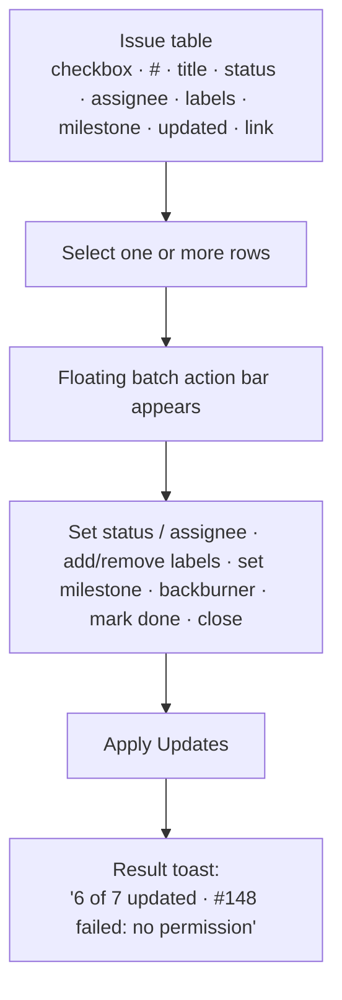

# Terragon — Application Design

UX and interface design for Terragon. This document supersedes the design/UI portions of `concept/concept.md` (§7–§11, §24, §31–§32). For technical structure see [`architecture.md`](./architecture.md).

## Design Principles

Terragon should feel **clean, quiet, fast, and builder-oriented** — closer to Linear / Raycast / Apple Settings than to Jira. Restraint is the brand.

- Minimal yet complete — every screen earns its place.
- Compact, information-dense cards without visual noise.
- Calm execution: muted palette, one accent color, subtle motion.
- Keyboard-first; the command palette is a primary surface, not a nicety.
- Avoid: Jira density, enterprise dashboards, excess color/icons, heavy modals.

## Information Architecture



Left sidebar nav: **Prep Station · Board · Grooming · Milestones · My Work · Settings**. A persistent top bar carries the repository switcher, search, and user menu.

## Primary Screens

| Screen | Purpose | Key elements |
|--------|---------|--------------|
| **Prep Station** (landing) | Work-readiness at a glance | Ready to Start · Active · Needs Review · Blocked · Backburner highlights |
| **Board** | Daily execution | Four-column Kanban with drag-drop |
| **Grooming** | Backlog refinement (signature feature) | Spreadsheet table, multi-select, batch bar |
| **Milestones** | Milestone tracking | Milestone cards + detail + progress |
| **My Work** | Personal focus | Issues assigned to current user |
| **Settings** | Configuration | Repo mapping, label config, sync prefs |

## Board

Fixed column order — Backburner is last so it never dominates attention:



**Card** (compact — no description on the board):

```
#142
Forecast Confidence Score
Vedanta · Forecast MVP · UX · Finance
```

Shows: issue number, title, assignee avatar, labels, milestone. Drag-drop is optimistic with <300ms feedback; a failed sync **reverts the card** and shows a specific error toast (see architecture §7).

## Issue Drawer

Clicking any card slides a **right-side drawer** (not a modal). Edits are inline wherever possible.

Contents: title · number · status · assignee · labels · milestone · description · GitHub link · updated timestamp · comments preview · activity preview. `Esc` closes.

## Grooming Mode (signature feature)

Gmail-style bulk editing — *not* enterprise workflow management.



Partial success is a first-class outcome, never a silent all-or-nothing failure.

## Component Inventory

- **Layout:** `AppShell` · `Sidebar` · `TopBar` · `RepositorySwitcher` · `UserMenu`
- **Board:** `BoardView` · `BoardColumn` · `IssueCard` · `IssueCardMetadata` · `DragOverlay`
- **Issue:** `IssueDrawer` · `IssueTitleEditor` · `IssueDescriptionEditor` · `AssigneePicker` · `LabelPicker` · `MilestonePicker` · `StatusPicker` · `GitHubLink`
- **Grooming:** `GroomingTable` · `IssueRow` · `BulkActionBar` · `BatchUpdatePanel` · `ApplyUpdatesButton` · `BatchResultToast`
- **Milestones:** `MilestoneCard` · `MilestoneDetail` · `MilestoneProgress`
- **Shared:** `CommandPalette` · `SearchInput` · `EmptyState` · `LoadingSkeleton` · `ErrorBanner` · `Toast`

## Design System

**Color** — restrained, near-monochrome with one accent:

| Token | Use |
|-------|-----|
| Background | near-white / near-black |
| Surface | subtle gray |
| Border | soft gray |
| Text primary | high contrast |
| Text secondary | muted |
| Accent | single primary color |
| Done | subtle green |
| Backburner | muted gray |

**Typography** — modern sans-serif, strong title hierarchy, compact metadata; no oversized dashboard type.

**Interaction** — fast hover states, smooth drawer open/close, subtle drag affordance, keyboard shortcuts, command palette.

## State Coverage

Every data surface must handle four states explicitly: **loading** (`LoadingSkeleton`), **empty** (`EmptyState`), **error** (`ErrorBanner`/`Toast` with specific copy), and **populated**. Error copy is calm and specific (`Could not update #142 — the milestone no longer exists`), never generic.

## Keyboard Shortcuts

```
⌘K        Command palette
N         New issue
G then B  Board
G then G  Grooming
G then M  Milestones
/         Search
Esc       Close drawer
```
