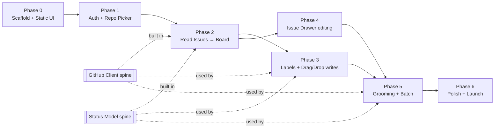

# Terragon — Implementation Plan

How we build Terragon, grounded in the locked decisions ([`concept-validation.md`](./concept-validation.md)), the architecture ([`architecture.md`](./architecture.md)), the UX ([`design.md`](./design.md)), and the prototype ([`prototype-review.md`](./prototype-review.md) + [`/fixtures/seed.ts`](../fixtures/seed.ts)).

**Assumptions:** small team (1–3 devs), no hard dates — phases are sequenced and sized **S / M / L** by relative effort. Each phase is a shippable vertical slice. The prototype is the UX source of truth; build *to it*, don't port it.

## Approach

1. **Two technical spines built early and shared by every phase:** the **GitHub Client** (one typed interface over GraphQL+REST) and the **Status Model** (label↔status resolution + transitions). These carry the risk; isolate and test them hard.
2. **Thin vertical slices.** Each phase ends with something demoable against a real repo (after Phase 1) or seed data (Phase 0).
3. **Derisk the two hard things first** — status reconciliation (validation §1–§2) and batch rate-limits (validation §3) — inside Phases 2–3 and 5, not at the end.

## Locked stack

| Layer | Choice |
|-------|--------|
| Framework | Next.js (App Router, Server Components) + TypeScript |
| UI | Tailwind + shadcn/ui (Radix); `@dnd-kit/core`; `cmdk` (palette) |
| Client state | TanStack Query (server cache) + Zustand (ephemeral UI) |
| Auth | Auth.js (NextAuth v5) + GitHub **OAuth App** provider |
| DB / ORM | **Neon Postgres** (Vercel Marketplace) + **Drizzle** (`drizzle-kit` migrations, `@neondatabase/serverless`) |
| GitHub | `octokit` — `.graphql` for reads, `.rest` for writes |
| Validation | `zod` (env, GitHub payloads, action inputs) |
| Hosting | Vercel (Node.js / Fluid Compute runtime — not edge) |

## Phase dependencies



---

## Phase 0 — Scaffold + Static UI · **M**

**Goal:** a clickable, on-brand prototype in Next.js, driven by fixtures — no network.

- `create-next-app` (TS, App Router, Tailwind); init shadcn/ui; route groups per architecture §9 (`(marketing)`, `(auth)`, `(app)`).
- Port the prototype's **design tokens, font (Inter), density/theme/accent presets, interaction constants, and microcopy** from [`ui-spec.md`](./ui-spec.md) (exact values) into the Tailwind theme + globals; light/dark.
- Build layout shell (`AppShell`, `Sidebar`, `TopBar`) and the **Board** + **Grooming** views as Server Components hydrated from [`/fixtures/seed.ts`](../fixtures/seed.ts).
- Implement the core components from design §"Component Inventory" with static data; drag/drop visual only, drawer opens, palette opens.
- Tooling: ESLint/Prettier, Vitest, Playwright, `.env.example`, CI (lint + typecheck + test).

**New deps:** next, tailwind, shadcn/ui, @dnd-kit/core, cmdk, zustand, @tanstack/react-query, vitest, @playwright/test.
**Deliverable:** Board + Grooming render from fixtures; matches prototype look/feel.
**Acceptance:** lighthouse-clean static app; CI green; both views navigable; theme toggle works.

## Phase 1 — Auth + Repo Picker · **M**

**Goal:** log in with GitHub, pick a repo, persist selection.

- Auth.js v5 with **GitHub OAuth App** provider; scopes `read:user`, `repo` (+ `public_repo` fallback). Session via HTTP-only cookie.
- Drizzle + Neon: create `users`, `accounts`, `user_repositories`, `repositories` tables (schema below). Auth.js **Drizzle adapter**.
- **Encrypt the GitHub access token at rest** (validation §8): wrap the adapter / encrypt on write with `TERRAGON_ENCRYPTION_KEY`; decrypt only inside the GitHub Client. (Auth.js stores tokens plaintext by default — override this.)
- Route protection in **`proxy.ts`** (Next 16) — gate `(app)/*` behind a session.
- Repo picker: list installable/accessible repos (REST `GET /user/repos`), store selection in `user_repositories.last_opened_at`.

**New deps:** next-auth@beta, @auth/drizzle-adapter, drizzle-orm, drizzle-kit, @neondatabase/serverless, octokit, zod.
**Deliverable:** login → repo list → select → land on board (still seed data).
**Acceptance:** login/logout work; token encrypted in DB (verify column is ciphertext); unauthenticated `(app)` routes redirect; selection persists across sessions.

## Phase 2 — Read Issues → Board · **L**  *(builds both spines)*

**Goal:** real GitHub issues on the board, status resolved correctly.

- **GitHub Client spine** (`lib/github/`): one typed class over Octokit. Phase-2 methods: `listIssues(repo, {state, cursor})` via **GraphQL** (paginated, fetches title/body/labels/assignees/milestone/state/updatedAt/url), `getIssue`. Centralize auth header, pagination, and rate-limit handling (retry + backoff, concurrency via `p-limit`).
- **Status Model spine** (`lib/status/`): pure functions, fully unit-tested.
  - `resolveStatus(issue, mapping)` implementing architecture §6: `closed → Done`; one `terragon/*` label → that; multiple → **precedence `in-progress > planned > backburner > done`**; none + mapped legacy label → mapped; else **default Planned**.
  - `transitionPlan(current, target, settings)` → `{ addLabel, removeLabels[], close?, reopen? }`.
- Board Service: group resolved issues into the four columns; sort/filter; feed Server Components. Wire TanStack Query for client refresh.
- Replace fixtures with live data behind a `USE_FIXTURES` flag (keep fixtures for tests/Storybook).

**Deliverable:** open a real repo → issues appear in correct columns; manual refresh.
**Acceptance:** status resolver unit tests cover every §6 branch incl. conflicting labels; board loads <2s for <200 open issues; pagination works on a large repo.

## Phase 3 — Labels + Drag/Drop writes · **L**

**Goal:** moving a card changes the GitHub issue, safely.

- GitHub Client writes (**REST**): `ensureLabels()` (create missing `terragon/*` on setup, with user confirmation), `addLabel`, `removeLabels`, `closeIssue`/`reopenIssue`.
- `moveIssue` Server Action implementing the §7 sequence with the **add-then-remove** ordering (validation §2) and **auto-close on Done** (`auto_close_done`, default on; reopen on move out).
- **Optimistic UI + rollback** (validation §7): dnd-kit move updates cache immediately; on failure, revert the card and show a specific error toast.
- Settings: label-mapping UI (map existing labels or create `terragon/*`); `workspace_settings` table.

**Deliverable:** drag a card → label changes in GitHub (and closes/reopens per setting); failures roll back.
**Acceptance:** label invariant holds even on induced failures (resolver self-heals); Done closes the issue when enabled; rollback verified by forcing a 4xx.

## Phase 4 — Issue Drawer editing · **M**

**Goal:** manage an issue without leaving Terragon.

- Drawer (design §"Issue Drawer"): inline edit title, body, status, assignee, labels, milestone; GitHub link; updated timestamp; comments + activity preview (read-only display for MVP).
- REST writes: `updateIssue` (title/body), `setAssignees`, `setMilestone`, label add/remove; reuse the move/transition logic for status changes from the drawer.
- Pickers: `AssigneePicker`, `LabelPicker`, `MilestonePicker`, `StatusPicker` backed by repo metadata (collaborators, labels, milestones — GraphQL reads).

**Deliverable:** open card → edit fields → changes land in GitHub.
**Acceptance:** each field edit round-trips; conflicting external edits surface via updated timestamp (no blind body overwrite).

## Phase 5 — Grooming + Batch · **L**  *(signature feature)*

**Goal:** Gmail-style bulk edits applied to GitHub with partial success.

- Grooming table (design §"Grooming Mode"): multi-select, select-all, floating batch bar. Batch actions broader than prototype: status, assignee, **add/remove labels, set milestone**, backburner, mark done, close.
- **Grooming Service** (`lib/grooming/`): `buildPlan(issues, changeset)` → per-issue op list; `execute()` with **controlled concurrency (≤3–5) + backoff on secondary rate-limit** (validation §3); returns `{ updated[], failed[{number, reason}] }`.
- **Partial-success reporting** (first-class): progressive UI for >20 issues; result toast/panel "6 of 7 updated · #148 failed: no permission". Audit each mutation to `sync_events`.

**Deliverable:** select N issues → apply changes → summary with per-issue outcomes.
**Acceptance:** induced partial failure reports correctly and doesn't abort the batch; no secondary-rate-limit errors on a 50-issue batch; all mutations audited.

## Phase 6 — Polish + Launch · **M**

**Goal:** a usable public MVP.

- **State coverage** everywhere (design §"State Coverage"): loading skeletons, empty states, specific error copy, expired-auth → re-login.
- Command palette (`cmdk`) wired to real nav/actions; full keyboard map (`⌘K`, `N`, `G then B/G/M`, `/`, `Esc`).
- Responsive layout; marketing/landing page; Prep Station / Milestones / My Work views (decorative in prototype → make real).
- Observability: Sentry + Vercel logs; verify audit table.

**Deliverable:** public MVP meeting all acceptance criteria below.

---

## Data model (Drizzle, MVP subset)

Tables for MVP — full schema in architecture §5. OAuth-App MVP omits `refresh_token`/`token_expires_at`.

```
users(id, github_user_id, github_login, name, avatar_url, timestamps)
accounts(id, user_id→users, provider, access_token_encrypted, timestamps)
repositories(id, github_repo_id, owner, name, full_name, private, default_branch, timestamps)
user_repositories(id, user_id→users, repository_id→repos, role, last_opened_at, timestamps)
workspace_settings(id, repository_id→repos, label_planned, label_in_progress,
                   label_done, label_backburner, auto_close_done DEFAULT true,
                   accent, default_theme, compact_cards, timestamps)  -- presets from ui-spec.md
sync_events(id, repository_id→repos, event_type, status, payload, error_message, created_at)
```

`issue_cache` and `grooming_drafts` are **deferred** (build only if reload/perf or draft-persistence demands it).

## Cross-cutting workstreams

- **GitHub Client** (`lib/github/`) — the only module touching GitHub; callers never see GraphQL vs REST. Owns rate-limit retry/backoff + concurrency limiter. Mocked (MSW/nock) in tests.
- **Status Model** (`lib/status/`) — pure, exhaustively unit-tested; the safety net for the non-atomic label problem.
- **Error handling** — specific, calm copy; partial success for batches; `Result`-style returns from Server Actions so the UI can roll back.
- **Security** — server-only GitHub calls; tokens encrypted at rest; HTTP-only Secure cookies; CSRF on mutations; min scopes; audit mutations.

## Testing strategy

| Level | Tool | Targets |
|-------|------|---------|
| Unit | Vitest | Status resolver (every §6 branch), `transitionPlan`, grooming `buildPlan`, env/zod schemas |
| Integration | Vitest + MSW/nock | GitHub Client methods incl. rate-limit/backoff and partial-failure paths |
| E2E | Playwright | login → repo pick → board; drag-drop + rollback; grooming batch with a forced partial failure |

CI (GitHub Actions): lint + typecheck + unit/integration on every PR; Playwright on main/preview.

## Environment

```
DATABASE_URL                 # Neon (Vercel Marketplace)
AUTH_SECRET                  # Auth.js
AUTH_GITHUB_ID / AUTH_GITHUB_SECRET   # GitHub OAuth App
TERRAGON_ENCRYPTION_KEY      # token encryption at rest
SENTRY_DSN                   # Phase 6
USE_FIXTURES                 # dev flag (Phase 0–2)
```

## MVP acceptance (from concept §29)

Auth (login/logout/profile) · repo select persists · issues load into 4 columns · drag updates GitHub label + UI reflects it · drawer views/edits issue · grooming multi-select applies status/assignee/labels/milestone with **partial-success reporting** · errors are specific · expired auth prompts re-login.

## Sequencing notes / risks

- **Build the two spines in Phase 2 before any write path.** Writes (Phase 3/5) depend entirely on correct resolution + transition planning.
- **Derisk rate limits early** — exercise a 50+ issue batch in Phase 5 dev against a real repo before polishing.
- **Auth.js token encryption** is the one non-obvious integration gotcha (it stores plaintext by default) — handle it in Phase 1, not later.
- **Don't build `issue_cache`/webhooks for MVP** — on-demand fetch + revalidate-after-mutation is sufficient (sync V2 is post-launch, architecture §7).
